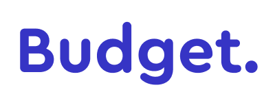

<p align="center">
    
</p>

# Budget. API

**Budget.** is my personal app for organize and managed my spendings and savings over years.\
This repository only contains Backend code and its based on **Clean Architecture**.

Technical information:

- .NET 7
- Swagger
- Auth0
- Postgres
- Mediatr
- FluentValidation
- Docker
- TestContainers

# Getting Started

### Authentication

---

First you need to setup an account, user and application on https://auth0.com/ \
Then put your configuration in the appsettings file.

```json
{
  "Auth": {
    "Authority": "<Auth0Authority>",
    "Audience": "<Auth0Audience>"
  }
}
```

Then, have a postgres server running, and put the connection string in the appsettings file.

```json
{
  "ConnectionStrings": {
    "Database": "Host=localhost;Port=5432;Database=budget_db;Username=postgres;Password=postgrespw"
  }
}
```

Finally, running the project

```bash
cd personal.budget/src/Api
dotnet run
```
