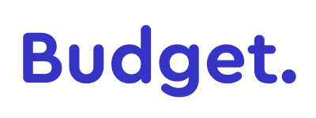

<p align="center">
    
</p>

# Budget. API

**Budget.** is my personal app for organize and managed my spendings and savings over years.\
This repository only contains Backend code and its based on **CQRS** and **Clean Architecture** standards.

Technical information:
- .NET 6
- Swagger
- Auth0
- Postgres
- Mediatr
- FluentValidation

# Getting Started

### Authentication

---
First you need to setup an account, user and application on https://auth0.com/ \
Then put your configuration in the appsettings file.

```json
{
  "Auth": {
    "Authority": "<Auth0Authority>",
    "Audience": "<Auth0Audience>"
  }
}
```

Then, have a postgres server running, and put the connection string in the appsettings file.

```json
{
  "ConnectionStrings": {
    "Database": "Host=localhost;Port=5432;Database=budget_db;Username=postgres;Password=postgrespw"
  }
}
```

Finally, running the project

```bash
cd personal.budget/src/Api
dotnet run
```

# Functionalities

Implemented
---

| Method                                                         | Endpoint                        | Description                                     |
|----------------------------------------------------------------|---------------------------------|-------------------------------------------------|
|     | `/tags `                        | Return all tags owned by the current user       |
|    | `/tags`                         | Create a new tag                                |
|   | `/tags/:id`                     | Change Name and Color of a tag                  |
|  | `/tags/:id`                     | Delete a tag                                    |
|     | `/accounts`                     | Return all accounts owned by the current user   |
|    | `/accounts`                     | Create a new account                            |
|   | `/accounts/:id`                 | Update account name or bank                     |
|   | `/accounts/:id/archived`        | Archived an account                             |
|  | `/accounts/:id`                 | Delete an account                               |
|     | `/operations?{operationFilter}` | Return all operations owned by the current user |
|    | `/operations`                   | Create new operations                           |
|  | `/operations/:id`               | Delete an operation                             |
|   | `/operations/:id`               | Update operation description, tag or amount     |

operationFilter:
```json

{
  "description": "string",
  "accountId": "guid",
  "tagIds": ["guid"],
  "operationType": "string",
  "pageSize": 25,
  "cursor": 0
}
```